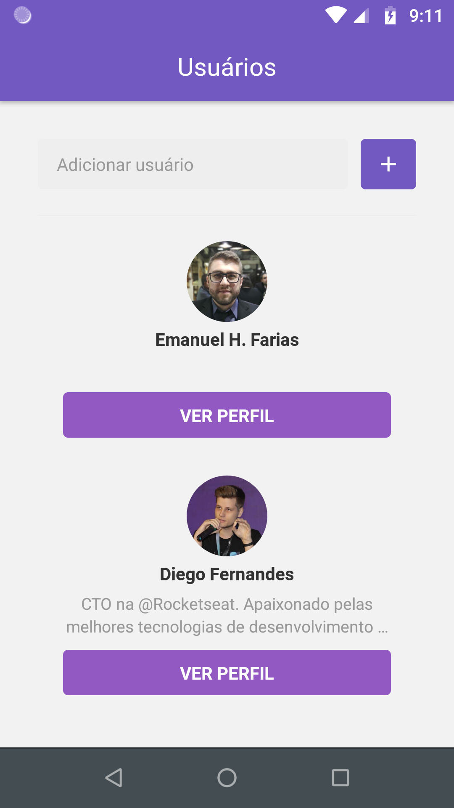
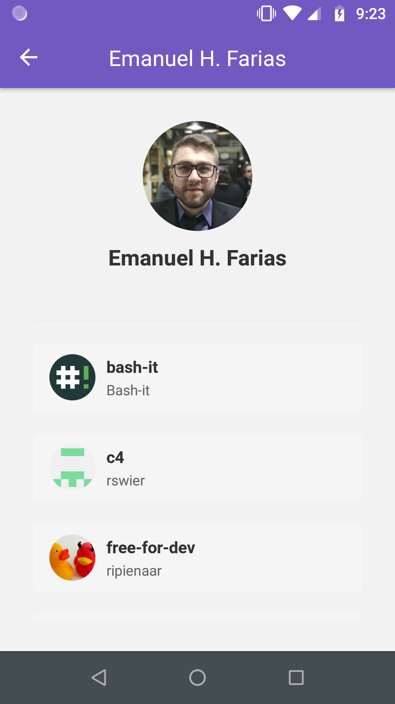
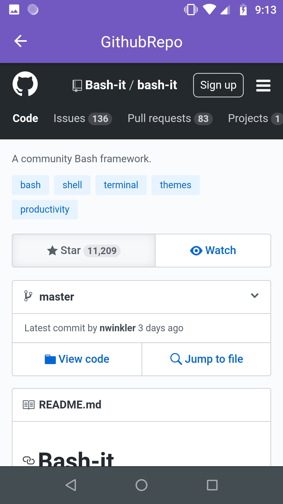

<h1 align="center">
  
</h1>


<h3 align="center">
  :rocket: [Bootcamp GoStack#10] Desafio 06
</h3>

## Desafio
Desenvolver uma aplicação em React que permite cadastrar perfils de usuários do Github.
A aplicação deverá consumir a API oficial do Github para buscar informações do usuário e seus repositórios favoritos.

[Link do Desafio](https://github.com/Rocketseat/bootcamp-gostack-desafio-06/blob/9840fd678778189eb221b395f99f7e09d072d3d4/README.md)


### Resultado
<h1 align="center">
  
  
  
</h1>

### Features
* Adiciona e lista usuários do GitHub
* Armezena usuários no **mobile Storage**
* Lista favoritos de um perfil (*starred*)
* **Scroll infinito** de favoritos
* **Pull to Refresh** para atualizar os favoritos
* Visualizar página do repositório via **WebView**

### Subindo a aplicação
```sh
git clone ...
cd bootcamp-gostack-desafio-06
yarn
react-native start
```

Rodando iOS: `pod install && react-native run-ios`  
Rodando Android: `react-native run-android`  
